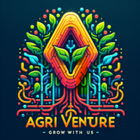

# Agriventure

Julie Montoux

## INIT
- REACT
- BACK 
   - sqlite en dev
   - python
        - Créer ton API
             - Swagger
        - Appeler ta base
- DEVOPS
  - CI/CD (déploiement)
- WIS
  - UI/UX (justification doc entreprise)
  - Charte graphique -> accessibilité (handicap) RGAA

## Sujet

### Contexte

L’entreprise EARL Villemur tient une vente directe de fruits. Elle est gérée aujourd’hui par des tableaux journaliers sur feuille et le calcul se fait à la main. L’entreprise aimerait digitaliser la partie de gestion des ventes pour faciliter la lecture et l’archivage des rapports de ventes.

### Cahier des charges

Création d’une app web appelée Agriventure.
Elle permettrait de :

- Créer une commande avec ses produits, son prix, sa ventilation de paiement, le vendeur, le reçu par mail à l’acheteur
- Création d’une fiche du détail de ventes à la journée avec le total des ventes, le détail de la ventilation de paiement
- Une page administrateur pour gérer les stocks, la caisse (entrée et sortie) et les vendeurs, paramétrage d’une interface personnalisable (dans la mesure du possible)
- Rapport de statistiques envoyées par mail à chaque fin de semaine automatiquement à l’entreprise
- Page de connexion à l’ouverture de l’application

### Charte graphique

### Logo



### Typographie

Barlow

### Colorimétrie

- Vert frais (pour évoquer la nature et les produits frais) : **#4CAF50**
- Orange chaleureux (pour symboliser la récolte et la convivialité) : **#FF9800**
- Brun terreux (pour rappeler la terre et la croissance) : **#795548**
- Bleu apaisant (pour la confiance et la simplicité) : **#2196F3**

## 1. Concevoir et Développer des Composants d’Interface Utilisateur

### Maquetter une Application

#### Outils Maquette

- **Figma** pour le maquettage de l'application.

#### Actions Maquette

- Utilisez le [projet Figma](https://www.figma.com/file/mdfXFG88TPPlde6sEcharQ/Agriventure?type=design&node-id=0%3A1&mode=design&t=YSNoo5u5meTV2ASu-1) pour créer des maquettes détaillées.
- Inspirez-vous de l'[interface vendeur](https://www.figma.com/file/aokDqDeEIfyAZlx4z5BPNi/Food-POS-Dark---Tablet-Device-(Community)?type=design&node-id=0-1&mode=design&t=5SN8kyK6ia271tWo-0) pour le dashboard admin.

### Développer une Interface Utilisateur de Type Desktop

#### Outils Desktop

- **ReactJS** ou **Angular** avec **PrimeNG** pour la partie front-end.

#### Actions Desktop

- Configurez votre environnement de développement pour ReactJS ou Angular.
- Installez PrimeNG pour avoir accès à des composants d'interface utilisateur de haute qualité.
- Créez les composants de base pour le dashboard admin en suivant les designs Figma.

### Développer des Composants d’Accès aux Données

#### Outils Base

- **API** en utilisant **Python**.
- **ORM** pour la gestion des bases de données, par exemple, **SQLAlchemy** pour Python.

#### Actions Base

- Développez une API RESTful en utilisant un framework comme Flask ou Django.
- Utilisez SQLAlchemy pour gérer les interactions avec la base de données.
- Assurez-vous que l'API respecte les bonnes pratiques de sécurité, telles que la validation des entrées et la protection contre les injections SQL.

### Développer la Partie Front-End d’une Interface Utilisateur Web

#### Outils Front

- **ReactJS** ou **Angular** avec **PrimeNG**.

#### Actions Front

- Utilisez les composants PrimeNG pour créer une interface utilisateur réactive et esthétique.
- Intégrez des pratiques de sécurité, comme la gestion des sessions et l'authentification des utilisateurs.
- Mettez en œuvre des contrôles de saisie pour prévenir les attaques de type XSS (Cross-Site Scripting).

### Développer la Partie Back-End d’une Interface Utilisateur Web

#### Outils Back

- **Python** avec des frameworks comme Flask ou Django.

#### Actions Back

- Créez les endpoints nécessaires pour votre application en utilisant Flask ou Django.
- Implémentez des mécanismes d'authentification et d'autorisation robustes (JWT, OAuth).
- Assurez la sécurité des données en transit en utilisant HTTPS.
- Configurez des contrôles de sécurité comme le CORS (Cross-Origin Resource Sharing).

#### Intégration et Déploiement

#### CI/CD

- Configurez un pipeline CI/CD avec GitHub Actions pour automatiser les tests, les builds et les déploiements.
- Assurez-vous que les tests de sécurité sont inclus dans votre pipeline CI/CD.

#### Sécurité des Composants

1. **Authentification et Autorisation** :
   - Utilisez des tokens JWT pour l'authentification.
   - Implémentez un contrôle d'accès basé sur les rôles (RBAC).

2. **Validation et Sanitation des Entrées** :
   - Validez et nettoyez toutes les entrées utilisateurs pour éviter les injections SQL et XSS.
   - Utilisez des bibliothèques de validation de données comme `cerberus` pour Python.

3. **Sécurité des API** :
   - Protégez vos endpoints avec des mécanismes d'authentification et des jetons CSRF.
   - Limitez les taux de requêtes pour prévenir les attaques DDoS.

4. **Sécurité des Données en Transit et au Repos** :
   - Utilisez HTTPS pour sécuriser les données en transit.
   - Chiffrez les données sensibles au repos avec des algorithmes de chiffrement robustes.

Voici la réponse mise à jour en fonction du schéma de base de données que vous avez fourni :

## 2. Concevoir et Développer la Persistance des Données

### Concevoir une Base de Données

#### Actions

- Utilisez l'outil [dbdiagram](https://dbdiagram.io/d/65d65b63783e8c6ca51cd8e7) pour créer et visualiser le schéma de votre base de données.
- Créez un modèle relationnel qui reflète les entités et leurs relations dans votre application.

Voici le schéma actualisé de votre base de données :

```sql
CREATE TABLE `companie` (
  `id` integer PRIMARY KEY,
  `name` integer,
  `logo` varchar(255),
  `number_vta` varchar(255),
  `email` varchar(255),
  `phone` varchar(255),
  `password` varchar(255)
);

CREATE TABLE `seller` (
  `id` integer PRIMARY KEY,
  `username` varchar(255),
  `password` varchar(255),
  `compagnie_id` integer
);

CREATE TABLE `products` (
  `id` integer PRIMARY KEY,
  `category` varchar(255),
  `variety` varchar(255),
  `description` text
);

CREATE TABLE `products_compagnie` (
  `id` integer PRIMARY KEY,
  `compagnie_id` integer,
  `products_id` integer,
  `weight` integer,
  `stock` integer
);

CREATE TABLE `sale` (
  `id` integer PRIMARY KEY,
  `seller_id` integer,
  `products_id` integer,
  `price` integer,
  `sales_breakdown_id` integer
);

CREATE TABLE `sales_breakdown` (
  `id` integer PRIMARY KEY,
  `name` varchar(255)
);

ALTER TABLE `seller` ADD FOREIGN KEY (`compagnie_id`) REFERENCES `companie` (`id`);

ALTER TABLE `products_compagnie` ADD FOREIGN KEY (`compagnie_id`) REFERENCES `companie` (`id`);

ALTER TABLE `products_compagnie` ADD FOREIGN KEY (`products_id`) REFERENCES `products` (`id`);

ALTER TABLE `sale` ADD FOREIGN KEY (`sales_breakdown_id`) REFERENCES `sales_breakdown` (`id`);

ALTER TABLE `sale` ADD FOREIGN KEY (`seller_id`) REFERENCES `seller` (`id`);

ALTER TABLE `sale` ADD FOREIGN KEY (`products_id`) REFERENCES `products_compagnie` (`id`);
```

### Mettre en Place une Base de Données

#### MySQL

1. **Installation** :

   - Installez MySQL sur votre machine de développement ou utilisez un service de base de données dans le cloud comme Amazon RDS.

2. **Configuration** :
   - Créez une base de données pour votre application.

   ```sql
   CREATE DATABASE agriventure_db;
   ```

3. **Utilisation** :
   - Connectez-vous à la base de données et exécutez le script SQL pour créer les tables.

#### SQLite

1. **Installation** :
   - Installez SQLite sur votre machine.

2. **Configuration** :
   - Créez une base de données SQLite.

### Développer des Composants dans le Langage d’une Base de Données

- Créez des requêtes SQL pour interagir avec votre base de données.

#### Exemple de Requêtes SQL

1. **Insertion de Données** :

   ```sql
   INSERT INTO seller (username, password, compagnie_id) VALUES ('seller1', 'hashed_password', 1);
   ```

2. **Sélection de Données** :

   ```sql
   SELECT * FROM products_compagnie WHERE compagnie_id = 1;
   ```

3. **Mise à Jour de Données** :

   ```sql
   UPDATE products_compagnie SET stock = stock - 1 WHERE id = 1;
   ```

4. **Suppression de Données** :

   ```sql
   DELETE FROM seller WHERE id = 1;
   ```

Pour concevoir et développer une application multicouche avec une page admin comprenant un dashboard, suivez ces étapes :

## 3. Concevoir et Développer une Application Multicouche

### Collaborer à la Gestion d’un Projet Informatique et à l’Organisation de l’Environnement de Développement

#### Outils

- Utilisez **Miro** ou **Monday.com** pour collaborer à la gestion du projet et à l'organisation de l'environnement de développement.
- Ces outils vous permettent de planifier les tâches, de suivre l'avancement du projet et de partager des idées avec l'équipe.

### Concevoir une Application

- Identifiez les besoins des utilisateurs et définissez les fonctionnalités de l'application.
- Utilisez des outils de maquettage comme Figma pour créer des wireframes et des prototypes de l'interface utilisateur.
- Implémentez une architecture multicouche pour séparer les différentes couches de l'application (présentation, métier, données).

### Développer des Composants Métier

#### Page Admin avec Dashboard

1. **Front-End** :
   - Utilisez React.js ou Angular pour développer le front-end de l'application.
   - Créez une page admin avec un dashboard pour afficher des informations pertinentes telles que les statistiques, les graphiques, etc.
   - Utilisez des bibliothèques comme Material-UI, Bootstrap ou PrimeReact pour concevoir des interfaces utilisateur attrayantes et réactives.

2. **Back-End** :
   - Utilisez Node.js avec Express.js ou Django pour développer le back-end de l'application.
   - Mettez en place des API RESTful pour récupérer et manipuler les données nécessaires à l'affichage du dashboard admin.
   - Implémentez la logique métier nécessaire pour agréger et traiter les données à afficher dans le dashboard.

3. **Base de Données** :
   - Utilisez MySQL, PostgreSQL ou MongoDB pour stocker les données de l'application.
   - Concevez et mettez en place une structure de base de données adaptée aux besoins de l'application, en tenant compte des données à afficher dans le dashboard admin.

### Construire une application organisée en couches

#### 1. **Développement du Dashboard Web**

##### Couche de Présentation (Frontend)

- **Technologies :** HTML, CSS, JavaScript, Angular, React ou Vue.js.
- **Description :** Le frontend du dashboard web sera développé en utilisant un framework JavaScript comme Angular, React ou Vue.js pour offrir une expérience utilisateur dynamique et interactive.

##### Couche de Service (Backend)

- **Technologies :** Node.js, Express.js, Java, Spring Boot, .NET Core, etc.
- **Description :** Le backend fournira des API RESTful pour la gestion des données et des fonctionnalités du dashboard. Cette couche contiendra la logique métier et communiquera avec la couche d'accès aux données.

##### Couche d'Accès aux Données

- **Technologies :** ORM (Object-Relational Mapping) comme Sequelize pour Node.js, Hibernate pour Java, Entity Framework pour .NET, etc.
- **Description :** Cette couche gérera l'accès aux bases de données, exécutera des opérations CRUD, et mappera les données entre les modèles et les entités de la base de données.

##### Couche Transversale

- **Technologies :** Services de sécurité (JWT, OAuth), gestion des erreurs, journalisation.
- **Description :** Gestion des préoccupations transversales comme l'authentification, l'autorisation, la journalisation et la gestion des exceptions.

#### 2. **Développement de l'Application de Caisse Enregistreuse Mobile**

##### Couche de Présentation (Frontend Mobile)

- **Technologies :** Ionic avec Angular, React Native, Flutter.
- **Description :** L'interface utilisateur mobile sera développée en utilisant des frameworks comme Ionic (avec Angular) ou React Native. Ces technologies permettent de créer des applications mobiles multiplateformes (iOS et Android).

##### Couche de Service (Backend) - Partagée

- **Technologies :** Partagée avec le dashboard web.
- **Description :** Les services backend pour l'application mobile peuvent être les mêmes que ceux utilisés pour le dashboard web, permettant ainsi de centraliser la logique métier et les API.

##### Couche d'Accès aux Données - Partagée

- **Technologies :** Partagée avec le dashboard web.
- **Description :** L'accès aux données sera également centralisé et partagé entre le dashboard web et l'application mobile.

##### Couche Transversale - Partagée

- **Technologies :** Partagée avec le dashboard web.
- **Description :** Les services de sécurité, de gestion des erreurs et de journalisation seront partagés entre les deux applications.

#### Architecture en Couches pour le Dashboard et l'Application Mobile

##### Dashboard Web

```bash
[Interface Utilisateur (Web)]
       |
       v
[Logique Métier/Service (Backend)]
       |
       v
[Accès aux Données (Database)]
       |
       v
[Base de Données]
```

#### Application Mobile

```bash
[Interface Utilisateur (Mobile)]
       |
       v
[Logique Métier/Service (Backend) - Partagée]
       |
       v
[Accès aux Données (Database) - Partagée]
       |
       v
[Base de Données]
```

#### Déploiement

1. **Dashboard Web :**
   - Déployez le frontend web sur un service d'hébergement web (comme Vercel, Netlify, ou un serveur web dédié).
   - Déployez le backend sur un service de cloud computing (comme AWS, Azure, Google Cloud) ou un serveur dédié.

2. **Application Mobile :**
   - Déployez l'application mobile sur les stores d'applications (App Store pour iOS et Google Play Store pour Android).
   - Configurez l'application mobile pour qu'elle communique avec le même backend utilisé par le dashboard web.

#### Avantages de cette Approche

1. **Centralisation du Backend :** Vous avez un backend centralisé qui sert à la fois le dashboard web et l'application mobile, ce qui simplifie la maintenance et la gestion des données.
2. **Réutilisabilité :** Les services et la logique métier sont réutilisés entre les deux applications, réduisant ainsi la duplication de code.
3. **Séparation des Préoccupations :** Chaque application (web et mobile) a sa propre couche de présentation, ce qui permet de les développer et de les maintenir indépendamment tout en partageant les couches de service et d'accès aux données.

### Développer une application mobile

#### 1. **Ionic Framework**

Ionic est un framework open-source qui permet de développer des applications mobiles multiplateformes (iOS, Android) en utilisant Angular. Il fournit une bibliothèque riche de composants UI et des outils pour faciliter le développement mobile.

**Avantages :**

- Composants UI optimisés pour les mobiles.
- Grande communauté et beaucoup de ressources.
- Support pour les fonctionnalités natives via Capacitor ou Cordova.

**Comment démarrer :**

1. Installer Ionic CLI : `npm install -g @ionic/cli`
2. Créer un nouveau projet : `ionic start myApp blank --type=angular`
3. Développer votre application en utilisant Angular.

#### 2. **Angular avec NativeScript**

NativeScript permet de développer des applications mobiles natives en utilisant Angular. Contrairement à Ionic, NativeScript rend les composants UI en utilisant des composants natifs plutôt que des composants web.

**Avantages :**

- Accès direct aux API natives.
- Performances proches des applications natives.

**Comment démarrer :**

1. Installer NativeScript CLI : `npm install -g nativescript`
2. Créer un nouveau projet : `tns create myApp --ng`
3. Développer votre application en utilisant Angular.

#### 3. **Angular avec Capacitor**

Capacitor, créé par l'équipe d'Ionic, permet d'ajouter des fonctionnalités natives à des applications web. Vous pouvez utiliser Capacitor pour transformer une application Angular en application mobile.

**Avantages :**

- Facilité d'intégration avec les projets Angular existants.
- Support pour les plugins natifs.

**Comment démarrer :**

1. Installer Capacitor : `npm install @capacitor/core @capacitor/cli`
2. Initialiser Capacitor dans votre projet Angular : `npx cap init`
3. Ajouter des plateformes (iOS, Android) : `npx cap add android` ou `npx cap add ios`
4. Développer et déployer votre application.

#### 4. **Progressive Web Apps (PWA)**

Une autre approche consiste à développer une PWA avec Angular. Les PWA sont des applications web qui offrent une expérience utilisateur similaire à celle des applications mobiles natives.

**Avantages :**

- Pas besoin de déploiement sur les stores d'applications.
- Fonctionne hors ligne grâce au service worker.
- Une seule base de code pour web et mobile.

**Comment démarrer :**

1. Ajouter le support PWA à votre projet Angular : `ng add @angular/pwa`
2. Configurer et optimiser votre PWA en fonction des besoins.

Bien sûr, voici une version plus concise :

### Préparer et Exécuter des Tests Unitaires

1. **Choix de l'Outil :** Sélectionnez un framework de test adapté à votre langage de programmation, comme Jest pour JavaScript ou pytest pour Python.

2. **Écrire les Tests :** Identifiez les parties critiques de votre code et écrivez des tests unitaires pour chaque fonction ou méthode, en couvrant différents cas de figure.

3. **Organiser les Tests :** Structurez vos tests de manière logique en regroupant les tests similaires et en utilisant des suites de tests pour une organisation hiérarchique.

4. **Exécuter les Tests :** Utilisez les commandes fournies par le framework de test pour exécuter les tests, en vérifiant les résultats pour identifier les échecs éventuels.

5. **Analyser les Résultats :** En cas d'échec, identifiez la cause du problème, corrigez-le et réexécutez les tests pour vous assurer que les modifications ont résolu le problème.

6. **Automatiser :** Intégrez les tests unitaires dans votre processus CI/CD pour une exécution automatique à chaque modification du code, assurant ainsi la fiabilité continue de l'application.

### Préparer et exécuter le déploiement d’une application

Création d’une CI/CD

#### Avantages

1. **Gestion centralisée :**
   - Tous les fichiers de configuration, dépendances et scripts de build se trouvent dans un seul endroit, ce qui peut simplifier la gestion du projet.
   - Un seul dépôt à cloner et à maintenir.

2. **Consistance :**
   - Les pratiques de développement, les conventions de codage et les processus de CI/CD peuvent être uniformes et cohérents entre les deux applications.

3. **Facilité de partage de code :**
   - Les bibliothèques internes ou les composants communs peuvent être partagés plus facilement entre les deux applications sans avoir à les publier ou à les synchroniser entre différents dépôts.

4. **Collaboration :**
   - Facilite la collaboration entre les équipes travaillant sur les deux applications, car toutes les discussions, les problèmes et les pull requests se trouvent au même endroit.

5. **Simplification des dépendances :**
   - Une seule gestion des dépendances partagées, ce qui réduit le risque de conflits de versions entre les deux applications.

#### Inconvénients

1. **Complexité accrue :**
   - La structure du dépôt peut devenir complexe, ce qui peut rendre difficile la navigation et la gestion des fichiers et des dossiers.
   - Les scripts de build et de déploiement doivent être configurés pour gérer les deux applications de manière distincte.

2. **CI/CD plus compliqué :**
   - Les pipelines CI/CD doivent être conçus pour s'adapter aux besoins de deux applications différentes, ce qui peut ajouter de la complexité et augmenter le temps de build et de test.

3. **Couplage indésirable :**
   - Les deux applications peuvent devenir étroitement couplées, ce qui rend difficile la séparation future si nécessaire.
   - Les modifications à une application peuvent potentiellement affecter l'autre, nécessitant des tests supplémentaires pour garantir que les deux applications fonctionnent correctement après chaque changement.

4. **Permissions et sécurité :**
   - Gérer les permissions et l'accès au dépôt peut être plus difficile, surtout si différentes équipes ou développeurs travaillent sur chaque application.
   - Les secrets et les configurations sensibles doivent être gérés avec soin pour éviter tout risque de fuite ou d'accès non autorisé.

5. **Scalabilité :**
   - Au fur et à mesure que les deux applications grandissent, le dépôt peut devenir plus difficile à gérer et à maintenir.
   - Les mises à jour et les migrations de dépendances peuvent devenir plus complexes et risquer d'affecter les deux applications en même temps.
